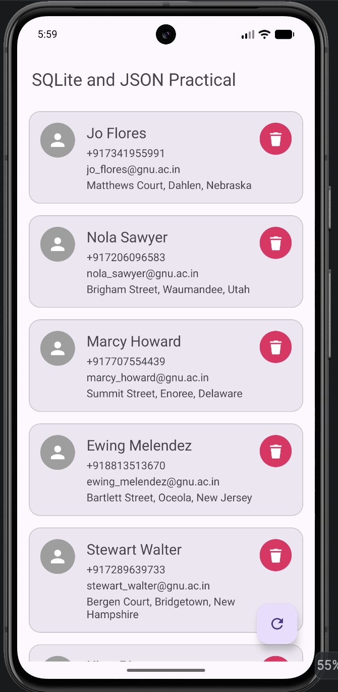

# Practical-7

---

**Aim:** To develop an Android application that retrieves person data in JSON format from an internet API and stores the retrieved data in an SQLite database.

## 🔗 Project Description

This application demonstrates fetching data from a **web API** and persisting it locally using **SQLite**, built with **Kotlin**. On launch, the app calls a **JSON-Generator** API endpoint over `HttpURLConnection`, parses the response into `Person` objects, and stores them in a local SQLite database. The saved contacts are then displayed in a **RecyclerView**, and the list survives app restarts since it is always read back from the database rather than the network.

The **Main Activity** shows every stored contact as a card with a name, phone number, email, and address, along with a delete action per contact and a floating action button to re-fetch fresh data from the API.

## Key Components:

- **MainActivity:** The single screen of the app. Loads existing contacts from SQLite on start, triggers the API fetch when the database is empty, and wires up the RecyclerView, delete action, and refresh FAB.

- **Person:** A model class holding `id`, `name`, `emailId`, `phoneNo`, `address`, `latitude`, and `longitude`. Implements `Serializable` so instances can be passed between components.

- **HttpRequest:** Handles communication with the web API using `HttpURLConnection`, attaching the `Authorization: Bearer` token and reading the JSON response stream into a string.

- **CoroutineScope / Dispatchers.IO:** Runs the network call and database writes on a background thread, then switches to `Dispatchers.Main` to safely update the UI once data is ready.

- **JSON Parsing:** Uses `org.json.JSONArray`/`JSONObject` to walk the API's nested response (`profile.name`, `profile.address`, `profile.location.lat/long`) and build `Person` objects.

- **DatabaseHelper:** A `SQLiteOpenHelper` subclass that creates the `persons` table and exposes insert, update, delete, and query operations.

- **PersonDbTableData:** Holds the table name, column names, and `CREATE TABLE` SQL statement used by `DatabaseHelper`.

- **PersonAdapter:** A `RecyclerView.Adapter` that binds each `Person` to a card layout and handles the delete-button click for its row.

- **RecyclerView + MaterialCardView:** Used to render the contact list as scrollable, elevated cards for a clean Material UI.

- **INTERNET Permission:** Declared in the manifest so the app can reach the JSON API over the network.

## Screenshot

  

---

  👤 <b>Dev Patel</b> &nbsp;•&nbsp; 🆔 <b>24012011080</b> &nbsp;•&nbsp; 🕒 Last Updated: <b>September 27, 2026</b>

